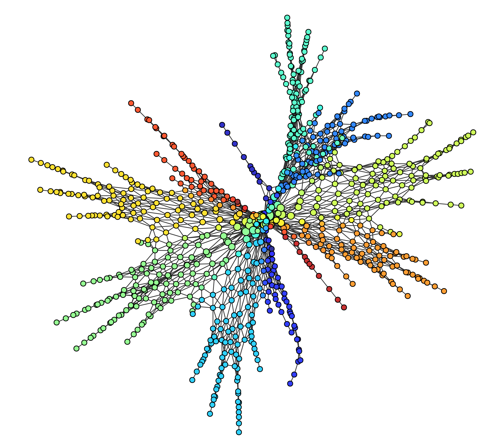

# pyBallMapper

[](https://pypi.org/project/pyBallMapper)
[](https://github.com/dioscuri-tda/pyBallMapper/actions/workflows/ci.yml)
[](https://pyballmapper.readthedocs.io/en/latest/?badge=latest)

Python implementation of the BallMapper algorithm ([arXiv:1901.07410](https://arxiv.org/abs/1901.07410)).

<picture>
  <source media="(prefers-color-scheme: dark)" srcset="img/jones_17_bm_white.png">
  
</picture>

## Install

```bash
pip install pyballmapper
```

Requires Python >= 3.13.

## Quick start

```python
from pyballmapper import BallMapper

bm = BallMapper(X=my_pointcloud, eps=4.669)
```

## Documentation

See the [full documentation](https://pyballmapper.readthedocs.io) and [example notebooks](https://github.com/dgurnari/pyBallMapper/tree/main/notebooks).

## Development

We use [uv](https://docs.astral.sh/uv/) for dependency management.

```bash
git clone https://github.com/dioscuri-tda/pyBallMapper.git
cd pyBallMapper
uv sync
uv run --group dev pre-commit install
uv sync --group docs           # optional, for building docs
```

See [contributing](https://pyballmapper.readthedocs.io/en/develop/contributing.html) for full guidelines.

Contributions, issues, and feature requests are warmly welcome. Feel free to open a PR or start a discussion!
