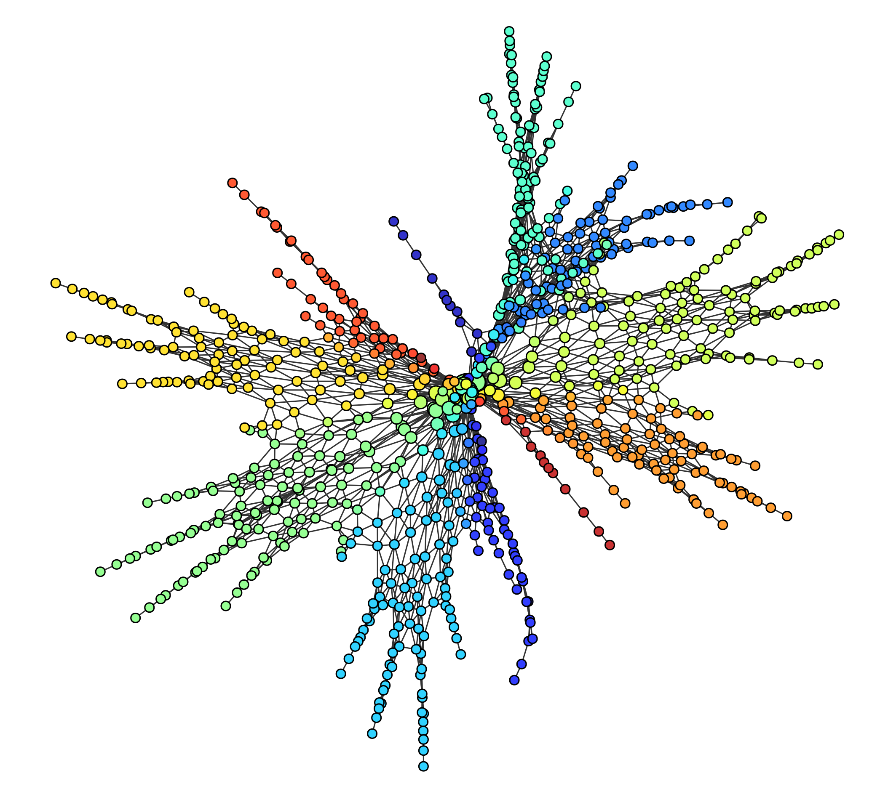

# pyBallMapper

[](https://pypi.org/project/pyBallMapper)
[](https://pyballmapper.readthedocs.io/en/latest/?badge=latest)

Python version of the BallMapper algorithm described in [arXiv:1901.07410 ](https://arxiv.org/abs/1901.07410) .  

<!---
<picture>
  <source media="(prefers-color-scheme: dark)" srcset="img/jones_17_bm_white.png">
  
</picture>
--->

### Installation  
```
pip install pyballmapper
```

### Basic usage
```
from pyballmapper import BallMapper
bm = BallMapper(X = my_pointcloud,    # the pointcloud, as a array-like of shape (n_samples, n_features)
                eps = 4.669)          # the radius of the covering balls
```

For more info check out the [example notebooks](https://github.com/dgurnari/pyBallMapper/tree/main/notebooks) or the [documentation](https://pyballmapper.readthedocs.io).
